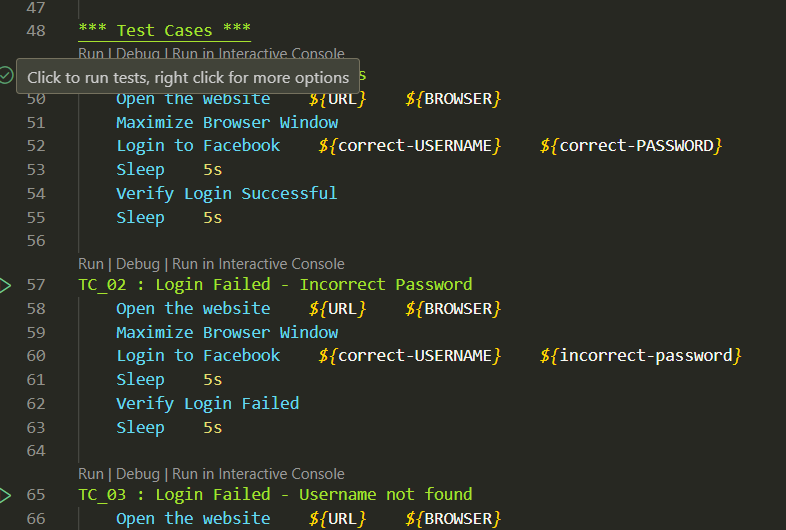
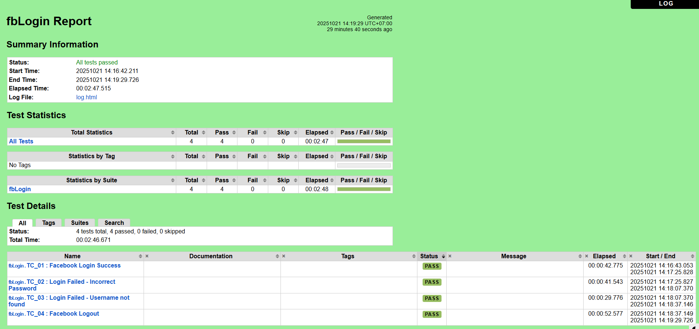
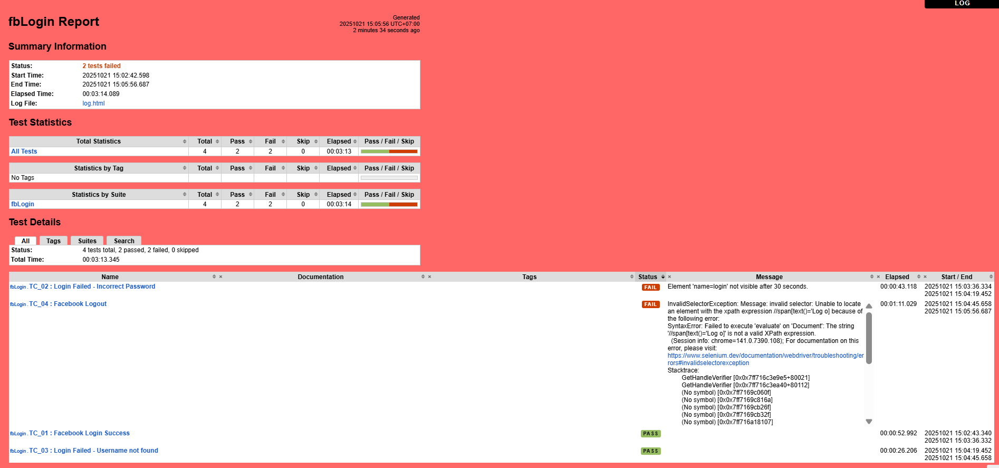
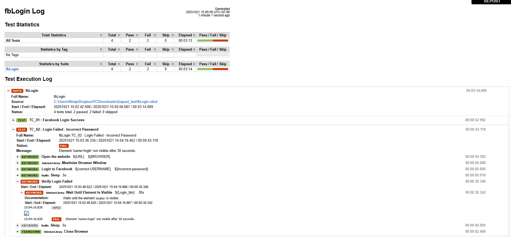
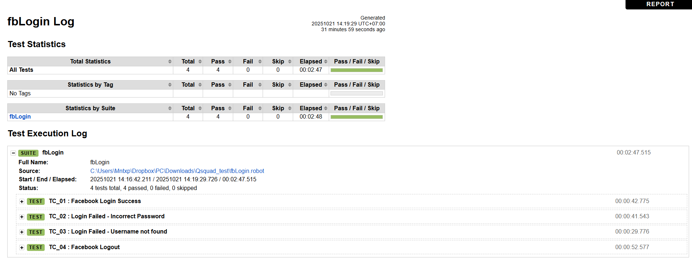
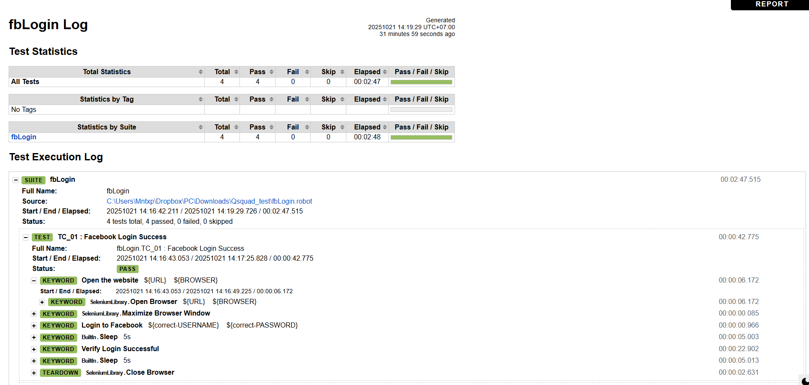

# Facebook Sign-in Automation Test (Robot Framework)
## Project overview 
This project automates the **Facebook Sign-in process** using **Robot Framework** with **SeleniumLibrary** following the test cases.

## Prerequisites
Before running the test, make sure you have:
- **Python 3.8 or above** installed 
    : You can download the latest version from (https://www.python.org/downloads/).
    
    **Note that** : During installation, select "**Install Now**" and do not forget to check the box "**Add Python 3.x to Path**". Then waiting for the installation to finish, before closing the installation window.
- **Google Chrome** browser installed  (Recommend)
- **ChromeDriver** that matching your Chrome version (or use **webdriver-manager**)

## Installations 
Open **Command Prompt (Windows)** / **Terminal (macOS)** / **VS Code Terminal**, then type this following command and run it respectively:

### For Windows :
    python --version   # Verify Python installation
    pip install robotframework
    pip install robotframework-seleniumlibrary
    pip install selenium
    pip install webdriver-manager   # Optional: auto manages by ChromeDriver

or you can type only this command (if you already installed Robot Framework SeleniumLibrary): 
        
    pip install --upgrade robotframework-seleniumlibrary
    pip show robotframework-seleniumlibrary   # Show the version and location it was installed

### For MacOS :
    python3 --version   # Verify Python installation
    pip3 install robotframework
    pip3 install robotframework-seleniumlibrary
    pip3 install selenium
    pip3 install webdriver-manager

or you can type only this command (**if you already installed Robot Framework SeleniumLibrary**): 
    
    pip3 install --upgrade robotframework-seleniumlibrary
    pip3 show robotframework-seleniumlibrary 

### For VS code Terminal : 
- #### On Windows 
    It will open as **PowerShell** or **Command Prompt** by default on your system. Therefore, you can use the **same commands as in the “For Windows” section**.

- #### On MacOS 
    The VS code terminal will open as **zsh** or **bash** by default.
    Therefore, you can use the **same commands as in the “For macOS” section**.

## Data Sections (Settings, Variables, Keywords, Test Cases)
### 1. Settings : 
This section is used to configure our Robot file — including importing libraries, resources, or even setting up commands to run before starting the tests.

- **Library SeleniumLibrary**
    : used to control browsers (i.e. open, click, input text, etc.)
- **Library BuiltIn**
    : Included the BuiltIn library here is optional, because Robot Framework automatically imports it by default.

    **Note that**: I added it explicitly to make it clear that some keywords, like Sleep, come from the BuiltIn library.

- **Test Teardown Close Browser**
    : runs automatically after each test case (in this case, is to close the browser)

### 2. Variables : 
This section is used for declaring variables and values that will be used in the Robot file. Each variable has an identifier to indicate its data type.

**Note that** : A test Facebook account was created specifically for testing purposes, since a real account cannot be used. 

- **${URL}  https://www.facebook.com** 
    -> Facebook homepage URL
- **${BROWSER}  chrome**
    -> Browser to open (Chrome in this case)
- **${input-user}  id=email**
    -> Locator for the email/username input field
- **${input-pass}  id=pass**
    -> Locator for the password field
- **${correct-USERNAME}  mnty.test@gmail.com**
    -> Valid test username(email)
- **${correct-PASSWORD}  Mnty19999**
    -> Valid test password
- **${incorrect-username}  any**
    -> Invalid username(email) for negative testing
- **${incorrect-password}  mon1234**
    -> Invalid password for negative testing
- **${Login_btn}  name=login**
    -> Locator for "Log In" button
- **${Logout_btn}  xpath=//span[text()='Log out']**
    -> Locator for "Log out" button

### 3. Keywords : 
This section can be thought of as methods or functions that we can use. 

**Note that** : It is particularly useful in cases where the commands or keywords provided by the imported libraries are insufficient. **"We can create our own custom keywords and use them directly"**.

- **Open the Website**
    -> Opens Facebook in the chosen browser (Chrome)
- **Login to Facebook**
    -> Inputs username and password, then clicks "Log In"
- **Verify Login Successful**
    -> Checks if main page appears after login
- **Verify Login Failed**
    -> Confirm that login button remains visible (login failed)
- **Logout from Facebook**
    -> Logs out by clicking profile, then press "Log out"

### 4. Test Cases : 
This section is for testing. When the Robot file is executed, the Test Cases will run.

**Note that** : 
If Meta authentication appears after login, complete it to allow the automation to continue.
However, if a notification request popup appears during the test, close it or click “Block” and wait briefly before the test continues.

- **TC_01: Facebook Login Success**
    - **Scenario**: Login with correct credentials
    - **Expected result**: Successfully logged in
- **TC_02: Login Failed - Incorrect Password**
    - **Scenario**: Login with incorrect password
    - **Expected result**: Login fails, login button still visible with an error message "**The password that you've entered is incorrect. Forgotten password?**"
- **TC_03: Login Failed - Username not found**
    - **Scenario**: Login with non-exiting username
    - **Expected result**: Login fails, login button still visible with an error message "**The email address or mobile number you entered isn't connected to an account. Find your account and log in.**"
- **TC_04: Facebook Logout**
    - **Scenario**: Logout after successful login
    - **Expected result**: User is logged out and redirected to the login page 

## How to run (Windows / MacOS / VS code)
- ### Option 1: Using VS Code Terminal :
    - Open **VS Code**
    - Open the folder **"Qsquad_test"**
    - Open the **integrated terminal**
    - **Run the test** using this command: 

            robot fbLogin.robot

        before pressing enter to runs all test cases.

    **Note that**: If you want to run only test case 1 (TC_01), you can click the checkmark in front of the test case name in VS Code.

    Otherwise, you can also run each test case individually using the command below:
        
        robot -t "TC_01 : Facebook Login Success" fbLogin.robot

- ### Option 2: Using Command Prompt/Powershell :
    Type and run these commands:
    
        cd Qsquad_test
        robot fbLogin.robot 
    before pressing enter to runs all test cases.

    **Note that**: If you want to run **only test case 1 (TC_01)**, you can click the checkmark in front of the test case name in VS Code.

    

    Otherwise, you can also run each test case individually using the command below:
        
        robot -t "TC_01 : Facebook Login Success" fbLogin.robot

- ### Option 3: Using macOS/Linux:
    Type and run these commands:
    
        cd Qsquad_test
        robot fbLogin.robot
    
    before pressing enter to runs all test cases.

    You can also **save logs in a specific (custom) folder** using this command:
    
        robot --outputdir results fbLogin.robot

    **Note that**: If you want to run **only test case 1 (TC_01)**, you can click the checkmark in front of the test case name in VS Code.

    ็

    Otherwise, you can also run each test case individually using the command below:

        robot -t "TC_01 : Facebook Login Success" fbLogin.robot

## Expected Results & Outputs
After the test is completed, Robot Framework will generate two files that you can use to review results and gather details to improve your scripts: **report.html and log.html**.

- ### report.html
    contains **three main sections** :
    - **Summary Information** :
        - **Status** : Shows the *overall test status*, indicating how many tests passed or failed
        - **Start Time** : Date and time when the test started
        - **End Time** : Date and time when the test finished
        - **Elapsed Time** : Total time taken for the test
        - **Log File** : Name of the log file
    - **Test Statistics** : A table *showing the total number of tests* and how many passed or failed.
    - **Test Details** : A table *listing the names of all test cases*, their *status*, and *execution time* for each test case.

        - **If all tests pass**, the *background will be green* to indicate that everything passed successfully.
            

        - **If there are any test cases that fail**, the *background will turn red*, indicating that some tests did not pass.
            

- ### log.html 
    shows similar results to **report.html**, but it provides much *more detailed information*.
    - Each test case is broken down to show which keyword failed, with details for every keyword used.
    
    - It also shows the time taken for each keyword.
    
    

    However, **log.html** does not include *Summary Information* or *background color indicators* like **report.html**.

## Troubleshooting
- ### Browser not opening
    - **Possible cause** : ChromeDriver mismatch
    - **Solution** : Update ChromeDriver or use webdriver-manager

- ### Login fails instantly / do not finish the flow
    - **Possible cause** : Facebook may block automation
    - **Solution** :  Use another test account

- ### Timeout waiting for element
    - **Possible cause** : Slow connection or page load
    - **Solution** :  Increase wait time or add/adjust more Sleep time (in second)
